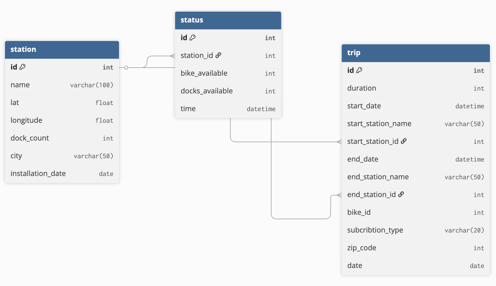
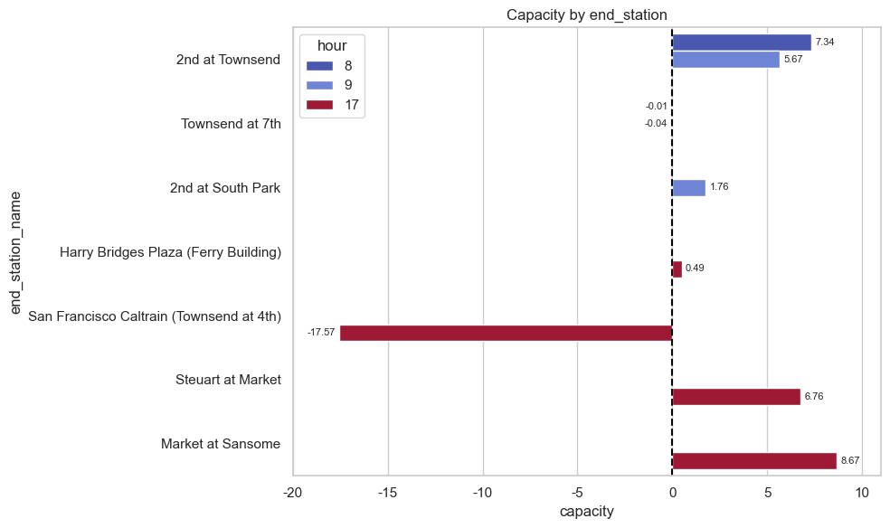

# San Francisco Bike Share Analysis
: Strategic Optimization of Bike Share for Maximizing Usage During Commuting Hours

## Project Summary
The aim of this project is to optimize bike supply and demand in San Francisco during commute hours in order to increase overall usage.
The project identifies shortages at start stations and surpluses at end stations, and proposes a redistribution strategy to nearby stations.
By analyzing usage patterns, the project ultimately aims to improve operational efficiency and boost bike usage.

## Data relationship

## Methodology 
- **MySQL** : To create a database, load data into tables, and perform various analyses by joining tables.
- **MySQL connect with Python** : To handle and visualize data in order to gain insights.

## Notebook
- Because of the discussion about Folium, you can find the fully preserved notebook here. [San-Francisco-bike-share.ipynb](https://nbviewer.org/github/joanna-jaeeun/San-Francisco-bike-share-analysis/blob/main/San%20Fransico%20Bike%20Share%20Analysis.ipynb)

## Strategies Flow 
All strategies was derived through SQL queries.
- Selecting city : Check the cities in the dataset using Folium, and filter to show only San Francisco.
- Checking usages by weekly and hourly
- Fining popular routes (Weekday, commute hours-morining and evening)
  - Defining commute hours to check the distribution
  - Popular routes
    

  
| start_hour   | end_hour | start_station_name | end_station_name | number |
|--------------|----------|--------------------|------------------|--------|
| 8            | 8        | Harry Bridges Plaza (Ferry Building) | 2nd at Townsend | 1341	|
| 9   | 9     | San Francisco Caltrain 2  (330 Townsend) | Townsend at 7th | 1018 |
| 9   | 9     | Market at Sansome | 2nd at South Park | 991 |

  
| start_hour   | end_hour | start_station_name | end_station_name | number |
|--------------|----------|--------------------|------------------|--------|
| 17           | 17        | Embarcadero at Sansome | Steuart at Market | 1064	|
| 17           | 17        | 2nd at Townsend | Harry Bridges Plaza  (Ferry Building) | 992 |
| 17           | 17        | 2nd at South Park | Market at Sansome | 911 |

  
- Proposing redistribution strategies
  
  - Is there enough supply at the start stations of the popular route?
        

  

<em>Checking Avg_demand, Avg_available, and Demand_Supply_gap at start station</em>
    

------
  - Identifying nearby bike rental stations within a 1 km radius of popular start stations

  
    

  - Is there enough capacity at the end stations of the popular route?
    : Checking Avg_arrivals, Remaining_bikes, and Capacity at end station
    

  

<em>Checking Avg_demand, Avg_available, and Demand_Supply_gap at start station</em>
    

  - Identifying nearby bike rental stations within a 1 km radius of popular end stations
<폴리움>

## Conclusions
- User perspective: Reduce user inconvenience caused by bike shortages during commute hours and lack of docking space at destination stations. Provide cost-saving incentives to encourage more frequent and economical use.

- Business perspective: Identify stations with persistent bike shortages or docking surpluses and implement optimized redistribution strategies. Increased user satisfaction is expected to lead to higher overall usage.

## Used Datasets
- SF Bay Area Bike Share [SF Bay Area Bike Share](https://www.kaggle.com/datasets/benhamner/sf-bay-area-bike-share/data)
